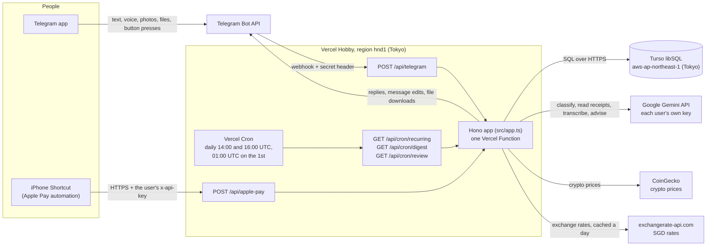
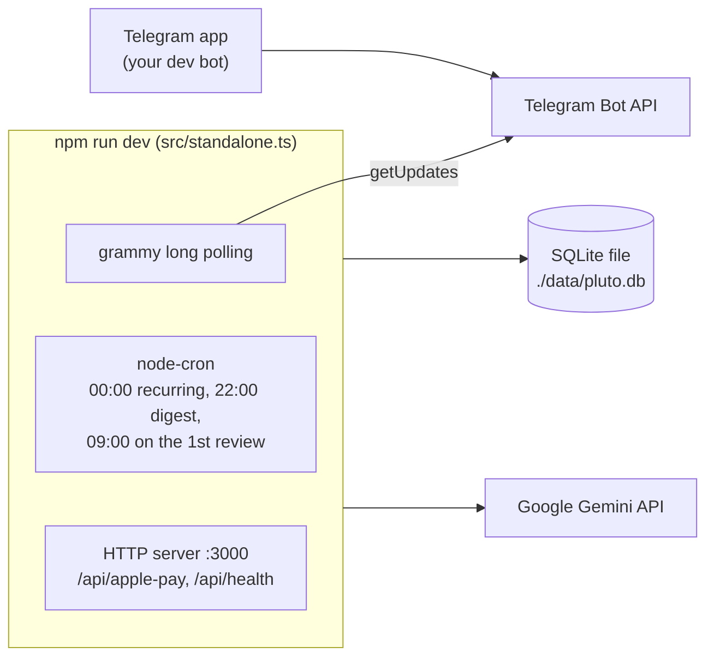
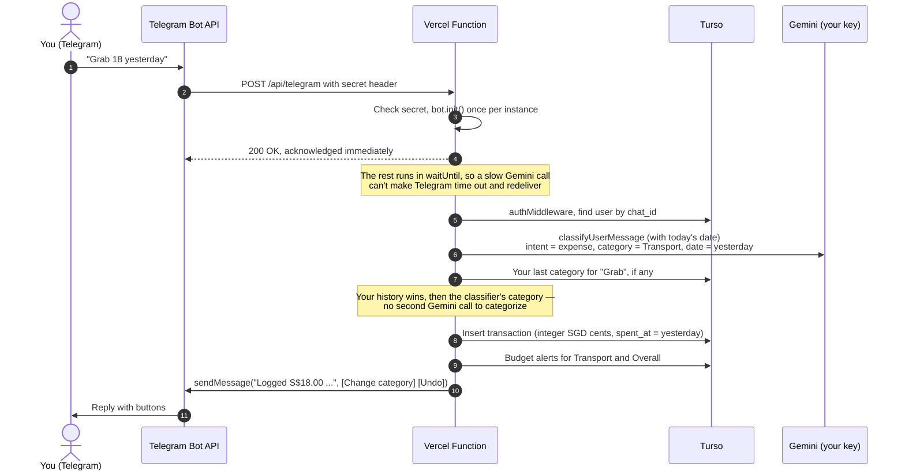
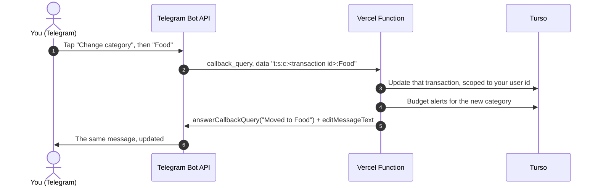
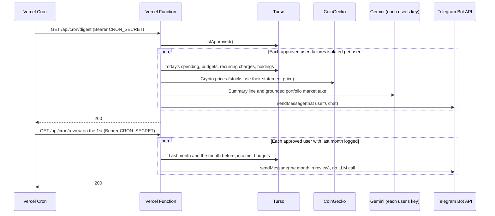
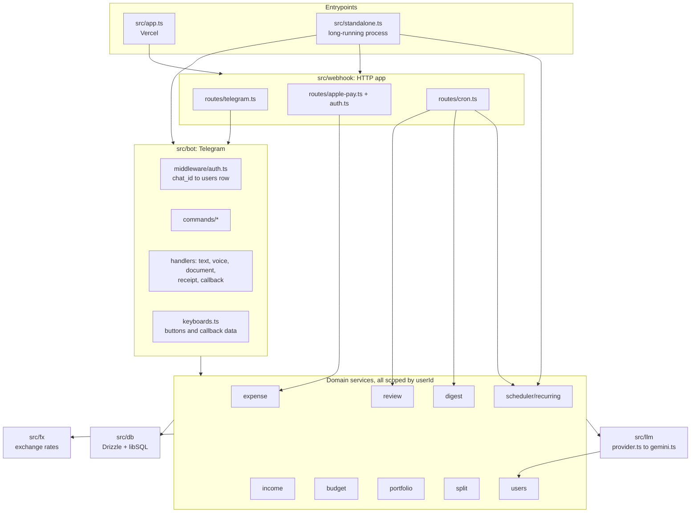
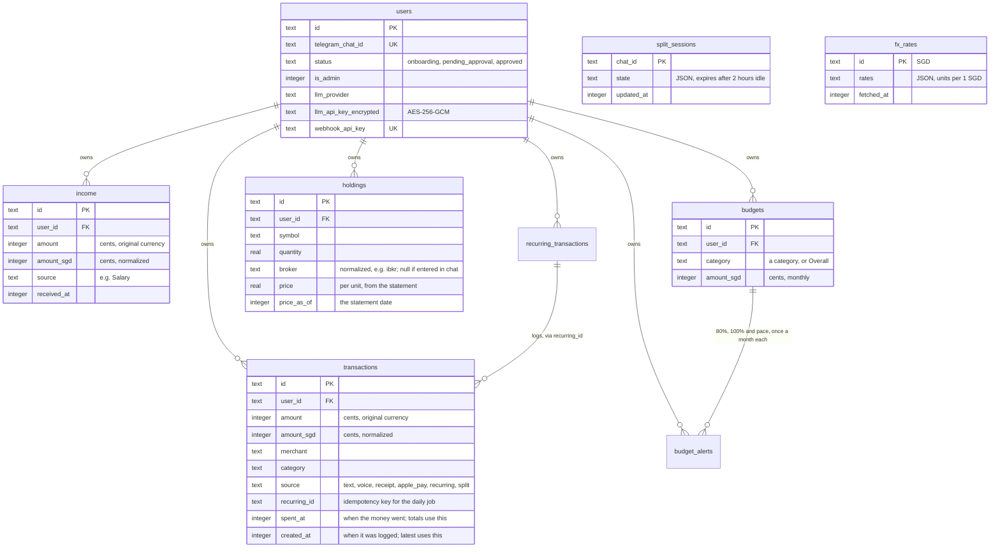

# Architecture

Plutus AI is one TypeScript codebase that runs in two ways:

| | **Production — Vercel + Turso** | **Local / self-hosted — standalone process** |
|---|---|---|
| Entrypoint | [`src/app.ts`](../src/app.ts), default-exports the Hono app | [`src/standalone.ts`](../src/standalone.ts), one long-running Node process |
| Telegram updates | Telegram **pushes** them to `POST /api/telegram` (webhook) | The process **long-polls** Telegram |
| Scheduled jobs | **Vercel Cron** calls `GET /api/cron/recurring`, `/digest` and `/review` | **node-cron** inside the process |
| Database | **Turso** (hosted libSQL), Tokyo | A local SQLite **file** (`file:./data/pluto.db`) |
| Migrations | During the Vercel build (`npm run vercel-build`) | On process startup |
| Apple Pay URL | `https://<project>.vercel.app/api/apple-pay` | `http://localhost:3000/api/apple-pay` (tunnel it to reach it from a phone) |

Both modes share every handler, service and query. The only differences are how
updates arrive and what triggers the scheduled jobs.

## Production: Vercel + Turso

Vercel and Turso sit in the same region (Tokyo). Turso has no Singapore
location, and a request makes several database round trips (auth lookup,
query, insert), so keeping the function next to the database matters more than
keeping it next to you. Telegram's servers, not your phone, call the webhook.

## Local development: the standalone process

Use a **separate bot token** locally. grammy's long polling deletes any
registered webhook when it starts, which would silently cut the production bot
off from Telegram. `startPolling()` refuses to start while a webhook is set.

## A message, end to end

## A button press

The buttons carry the transaction id, so no function instance has to remember
what a message was about. Replying to a message with buttons works the same
way: Telegram includes the replied-to message's buttons, and the correction
goes to that transaction.

## The scheduled jobs

The recurring-charge job (`/api/cron/recurring`, midnight) works the same way:
it logs each due charge once, then pushes any budget alert it triggers.

## Code map

## Data model

`split_sessions` is keyed by Telegram chat rather than by user. `reject()`
clears it along with the user's other rows.

## Design decisions worth knowing

- **Every inbound route checks a secret.** `/api/telegram` checks Telegram's
  secret-token header, `/api/cron/*` checks Vercel's `Bearer CRON_SECRET`, and
  `/api/apple-pay` checks each user's own key. Each one refuses to run if its
  secret isn't configured, rather than running unauthenticated. Otherwise a
  forged update could `/approve` a stranger, and anyone could trigger a digest
  to every user.
- **Button data is untrusted.** A button's callback data comes back from the
  client, so every action it triggers looks the transaction up by id *and* the
  pressing user's id. A forged id for someone else's expense finds nothing.
- **An expense has two times.** `spent_at` is when the money was spent
  ("yesterday", a receipt's date); totals, budgets and the review use it.
  `created_at` is when it was logged; `/undo` and `/recent` use that. Queries
  read `coalesce(spent_at, created_at)`, because the build migrates the
  database while the previous deployment is still logging rows without
  `spent_at`.
- **Categorizing is cheap.** A merchant the user has logged before takes its
  last category (corrections included) with no LLM call; a new one takes the
  category the classifier already worked out. So a chat expense costs one
  Gemini call, and a known Apple Pay merchant none.
- **Foreign keys are not relied on.** SQLite only enforces them per
  connection, and Turso's remote sessions aren't pinned to one connection. The
  schema still declares `ON DELETE CASCADE`, but `reject()` and
  `removeBudget()` delete child rows explicitly, in one atomic `batch`.
- **Nothing lives in process memory between requests.** On Vercel, consecutive
  messages can reach different function instances, so the `/split`
  conversation is stored in `split_sessions`, and buttons carry their own
  context. A split expires after two idle hours, because while it's active it
  captures every text message and photo. The price cache stays in memory and
  just gets rebuilt.
- **The scheduled jobs are idempotent where it matters.** The recurring job
  skips any charge whose `recurring_id` was already logged today, because a
  cron call can arrive twice and the standalone process runs the job both at
  startup and at midnight. A duplicated digest or review is only a repeated
  message, so those aren't deduplicated.
- **The timezone is pinned in code.** Vercel reserves `TZ` and runs in UTC, so
  the config sets `process.env.TZ = APP_TIMEZONE` before any date math. The
  Vercel Cron schedules are UTC: `0 14 * * *` = 22:00 SGT digest,
  `0 16 * * *` = 00:00 SGT recurring charges, `0 1 1 * *` = 09:00 SGT on the
  1st for the month review.
- **Migrations run at build time, never on preview builds.** A deploy migrates
  Turso before the new code serves traffic. A preview branch can't apply an
  unreviewed schema change to production data.
- **`/export` is sent as a file.** The CSV is built in memory and sent as a
  Telegram document. Nothing is written to disk, which is read-only on Vercel.
- **Stocks are valued at statement prices, not live quotes.** A statement
  from any broker, in any layout, is read by the user's own model into
  positions with a unit price and a date, and the next statement from the same
  broker replaces them. Only crypto is priced live.
- **Exchange rates are cached for a day in the database**, not only in
  memory. On Vercel a memory-only cache would call the API on almost every
  cold start, and the free plan allows 1,500 requests a month.
